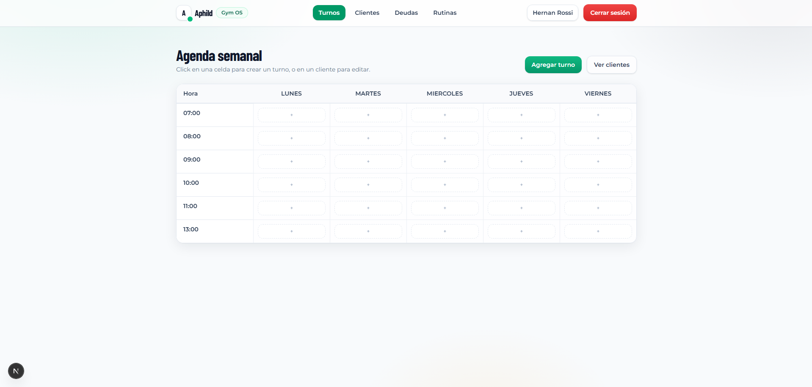
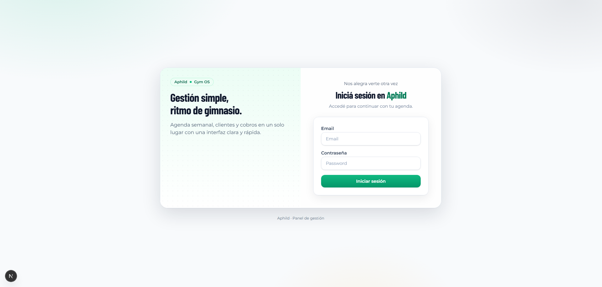
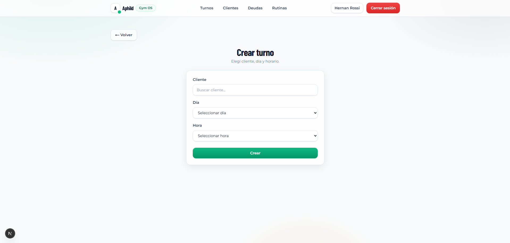
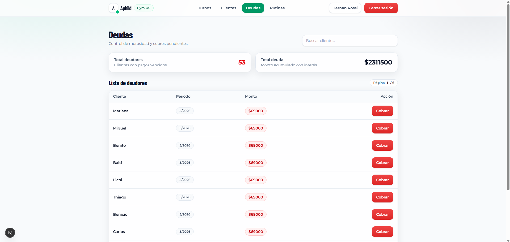
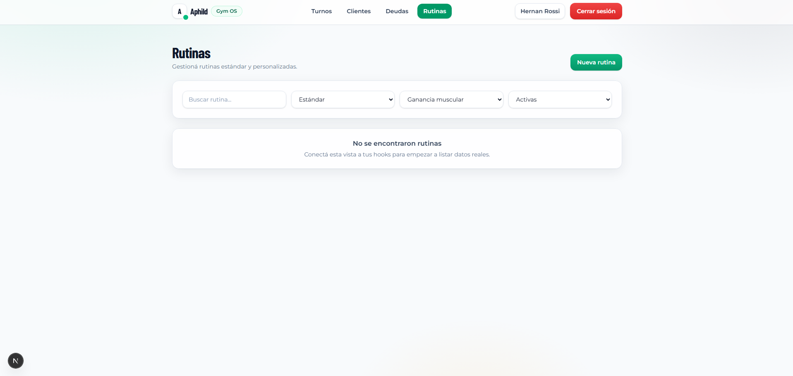

# Sistema de Gestión de Clientes y Turnos para Entrenador Personal

Aplicación full-stack desarrollada para que un **entrenador personal de gimnasio** pueda gestionar sus clientes, organizar sus turnos de entrenamiento desde una agenda semanal, administrar las deudas de los mismos y gestionar sus rutinas personalizadas, evitando la gestion manual en documentos como word.

---

## Tecnologías utilizadas

### Frontend
- Next.js
- TailwindCSS

### Backend
- NestJS
- TypeORM
- PostgreSQL

### Infraestructura
- Docker

---

## Funcionalidades

- Sistema de autenticación
- Gestión de clientes
- Búsqueda de clientes
- Creación y edición de clientes
- Agenda semanal de turnos
- Creación de turnos
- Organización de horarios por día y hora
- Visualización clara de la agenda del entrenador
- Control de deudas automatizadas por fecha con CronJob
- Cobro de deudas
- Creación de rutinas estandar o personalizadas
- Asignación de rutinas a clientes

---

## Arquitectura

La aplicación sigue una arquitectura **full-stack separada**:

### Frontend
- Aplicación desarrollada con **Next.js**
- Interfaz construida con **TailwindCSS**

### Backend
- API REST desarrollada con **NestJS**
- Manejo de base de datos mediante **TypeORM**
- Base de datos relacional **PostgreSQL**

### Infraestructura
- Entorno de desarrollo y despliegue utilizando **Docker**

---

## Capturas del sistema

### Login

### Agenda semanal

### Crear turno

### Gestion de deudas

### Gestion de rutinas

### Gestion de clientes

---

## Nota

Este proyecto fue desarrollado para un **cliente real**.

El código fuente es privado debido a razones comerciales.
